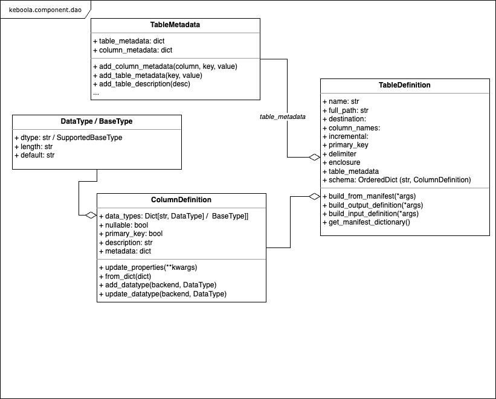

# Keboola Python Component library

## Introduction


[](https://codeclimate.com/github/keboola/python-component)
[](https://badge.fury.io/py/keboola.component)

This library provides a Python wrapper over the
[Keboola Common Interface](https://developers.keboola.com/extend/common-interface/). It simplifies all tasks related
 to the communication of the [Docker component](https://developers.keboola.com/extend/component/) with the Keboola Connection that is defined by the Common Interface. 
 Such tasks are config manipulation, validation, component state, I/O handling, I/O metadata and manifest files, logging, etc.
 
 It is being developed by the Keboola Data Services team and officially supported by Keboola. It aims to simplify the Keboola Component creation process,
 by removing the necessity of writing boilerplate code to manipulate with the Common Interface. 
 
 Another useful use-case is within the Keboola [Python Transformations](https://help.keboola.com/transformations/python/) to simplify the I/O handling.
 
 ### Links
 
 - API Documentation: [API docs](https://github.com/keboola/python-component/tree/main/docs/api-html/component/interface.html)
 - Source code: [https://github.com/keboola/python-component](https://github.com/keboola/python-component)
 - PYPI project code: [https://test.pypi.org/project/keboola.component-kds/](https://test.pypi.org/project/keboola.component-kds/)
 - Documentation: [https://developers.keboola.com/extend/component/python-component-library](https://developers.keboola.com/extend/component/)
 - Python Component template project: [https://bitbucket.org/kds_consulting_team/kbc-python-template/src/master/](https://bitbucket.org/kds_consulting_team/kbc-python-template/src/master/)


# Quick start
 
## Installation 
 
 The package may be installed via PIP:
 
 ```
pip install keboola.component
```


## Core structure & functionality 

The package contains two core modules:

- `keboola.component.interface` - Core methods and class to initialize and handle the [Keboola Common Interface](https://developers.keboola.com/extend/common-interface/) tasks
- `keboola.component.dao` - Data classes and containers for objects defined by the Common Interface such as manifest files, metadata, environment variables, etc.
- `keboola.component.base` - Base classes to build the Keboola Component applications from.


## CommonInterface

Core class that serves to initialize the docker environment. It handles the following tasks:

- Environment initialisation
   - Loading all [environment variables](https://developers.keboola.com/extend/common-interface/environment/#environment-variables)
   - Loading the [configuration file](https://developers.keboola.com/extend/common-interface/config-file/) and initialization of the [data folder](https://developers.keboola.com/extend/common-interface/folders/)
   - [State file](https://developers.keboola.com/extend/common-interface/config-file/#state-file) processing.
   - [Logging](https://developers.keboola.com/extend/common-interface/logging/)
- [Data folder](https://developers.keboola.com/extend/common-interface/folders/) manipulation
    - [Manifest file](https://developers.keboola.com/extend/common-interface/manifest-files/) processing
    - Config validation
    - Metadata manipulation
    - [OAuth](https://developers.keboola.com/extend/common-interface/oauth/) configuration handling.

## Initialization

The core class is `keboola.component.interface.CommonInterface`, upon it's initialization the environment is 
created. e.g.

- data folder initialized (either from the Environment Variable or manually)
- config.json is loaded
- All Environment variables are loaded

The optional parameter `data_folder_path` of the constructor is the path to the data directory.
If not provided, [`KBC_DATADIR` environment variable](/extend/common-interface/environment/#environment-variables) will be used.

The class can be either extended or just instantiated and manipulated like object. 
The `CommonInterface` class is exposed in the `keboola.component` namespace:

```python
from keboola.component import CommonInterface
# init the interface
# A ValueError error is raised if the KBC_DATADIR does not exist or contains non-existent path.
ci = CommonInterface()
```

To specify the data folder path manually use this code:

```python
from keboola.component import CommonInterface
# init the interface
# A ValueError error is raised if the data folder path does not exist.
ci = CommonInterface(data_folder_path='/data')
```

## Loading configuration parameters:

The below example loads initializes the common interface class and automatically loading config.json from the 
[data folder](https://developers.keboola.com/extend/common-interface/folders/) which is defined by an environment variable `KBC_DATADIR`,
 if the variable is not present, and error is raised. To override the data folder location provide the `data_folder_path` parameter into constructor. 
 
 **NOTE:** The `configuration` object is initialized upon access and a ValueError is thrown if the `config.json` does not exist 
 in the data folder. e.g. `cfg = ci.configuration` may throw a ValueError even though the data folder exists and ci (CommonInterface) 
 is properly initialized.

```python
from keboola.component import CommonInterface
# Logger is automatically set up based on the component setup (GELF or STDOUT)
import logging

SOME_PARAMETER = 'some_user_parameter'
REQUIRED_PARAMETERS = [SOME_PARAMETER]

# init the interface
# A ValueError error is raised if the KBC_DATADIR does not exist or contains non-existent path.
ci = CommonInterface()


# A ValueError error is raised if the config.json file does not exists in the data dir.
# Checks for required parameters and throws ValueError if any is missing.
ci.validate_configuration(REQUIRED_PARAMETERS)

# print KBC Project ID from the environment variable if present:
logging.info(ci.environment_variables.project_id)

# load particular configuration parameter
logging.info(ci.configuration.parameters[SOME_PARAMETER])
```


## Processing input tables - Manifest vs I/O mapping

Input and output tables specified by user are listed in the [configuration file](/extend/common-interface/config-file/). 
Apart from that, all input tables provided by user also include manifest file with additional metadata.

Tables and their manifest files are represented by the `keboola.component.dao.TableDefinition` object and may be loaded 
using the convenience method `get_input_tables_definitions()`. The result object contains all metadata about the table,
such as manifest file representations, system path and name.


### Manifest & input folder content

```python
from keboola.component import CommonInterface
import logging

# init the interface
ci = CommonInterface()

input_tables = ci.get_input_tables_definitions()

# print path of the first table (random order)
first_table = input_tables[0]
logging.info(f'The first table named: "{first_table.name}" is at path: {first_table.full_path}')


# get information from table manifest
logging.info(f'The first table has following columns defined in the manifest {first_table.columns}')

```

### Using I/O mapping

```python
import csv
from keboola.component import CommonInterface

# initialize the library
ci = CommonInterface()

# get list of input tables from the input mapping ()
tables = ci.configuration.tables_input_mapping
j = 0
for table in tables:
    # get csv file name
    inName = table.destination
    
    # read input table manifest and get it's physical representation
    table_def = ci.get_input_table_definition_by_name(table.destination)

    # get csv file name with full path from output mapping
    outName = ci.configuration.tables_output_mapping[j].full_path

    # get file name from output mapping
    outDestination = ci.configuration.tables_output_mapping[j]['destination']
```

## I/O table manifests and processing results

The component may define output [manifest files](https://developers.keboola.com/extend/common-interface/manifest-files/#dataouttables-manifests) 
that define options on storing the results back to the Keboola Connection Storage. This library provides methods that simplifies 
the manifest file creation and allows defining the export options and metadata of the result table using helper objects `TableDefinition` 
and `TableMetadata`.


`TableDefinition` object serves as a result container containing all the information needed to store the Table into the Storage. 
It contains the manifest file representation and initializes all attributes available in the manifest.


This object represents both Input and Output manifests. All output manifest attributes are exposed in the class.

There are convenience methods for result processing and manifest creation `CommonInterface.write_manifest`. 
Also it is possible to create the container for the output table using the `CommonInterface.create_out_table_definition()`.




**Example:**

```python
from keboola.component import CommonInterface
from keboola.component import dao

# init the interface
ci = CommonInterface()

# create container for the result
result_table = ci.create_out_table_definition('my_new_result_table', primary_key=['id'], incremental=True)

# write some content
with open(result_table.full_path, 'w') as result:
    result.write('line')

# add some metadata
result_table.table_metadata.add_table_description('My new table description')
# add column datatype
result_table.table_metadata.add_column_data_type('id', dao.SupportedDataTypes.STRING, 
                                                 source_data_type='VARCHAR(100)', 
                                                 nullable=True,
                                                 length=100)

# write manifest
ci.write_manifest(result_table)
```

### Get input table by name

```python
from keboola.component import CommonInterface


# init the interface
ci = CommonInterface()
table_def = ci.get_input_table_definition_by_name('input.csv')

```

### Initializing TableDefinition object from the manifest file

```python
from keboola.component import dao

table_def = dao.TableDefinition.build_from_manifest('data/in/tables/table.csv.manifest')

# print table.csv full-path if present:

print(table_def.full_path)

# rows count

print(table_def.rows_count)
```

### Retrieve raw manifest file definition (CommonInterface compatible)

To retrieve the manifest file representation that is compliant with Keboola Connection Common Interface 
use the `table_def.get_manifest_dictionary()` method. 


```python
from keboola.component import dao

table_def = dao.TableDefinition.build_from_manifest('data/in/tables/table.csv.manifest')

# get the  manifest file representation
manifest_dict = table_def.get_manifest_dictionary()

```


## Processing input files

Similarly as tables, files and their manifest files are represented by the `keboola.component.dao.FileDefinition` object and may be loaded 
using the convenience method `get_input_files_definitions()`. The result object contains all metadata about the file,
such as manifest file representations, system path and name.

The `get_input_files_definitions()` supports filter parameters to filter only files with a specific tag or retrieve only the latest file of each. 
This is especially useful because the KBC input mapping will by default include all versions of files matching specific tag. By default, the method 
returns only the latest file of each.

```python
from keboola.component import CommonInterface
import logging

# init the interface
ci = CommonInterface()

input_files = ci.get_input_files_definitions(tags= ['my_tag'], only_latest_files=True)

# print path of the first file (random order) matching the criteria
first_file = input_files[0]
logging.info(f'The first file named: "{input_files.name}" is at path: {input_files.full_path}')


```


When working with files it may be useful to retrieve them in a dictionary structure grouped either by name or a tag group. 
For this there are convenience methods `get_input_file_definitions_grouped_by_tag_group()` and `get_input_file_definitions_grouped_by_name()`


```python
from keboola.component import CommonInterface
import logging

# init the interface
ci = CommonInterface()

# group by tag
input_files_by_tag = ci.get_input_file_definitions_grouped_by_tag_group(only_latest_files=True)

# print list of files matching specific tag
logging.info(input_files_by_tag['my_tag']) 


# group by name
input_files_by_name = ci.get_input_file_definitions_grouped_by_name(only_latest_files=True)

# print list of files matching specific name
logging.info(input_files_by_name['image.jpg'])

```

## Processing state files

[State files](https://developers.keboola.com/extend/common-interface/config-file/#state-file) can be easily written and loaded 
using the `get_state_file()` and `write_state_file()` methods:
 
```python
from keboola.component import CommonInterface
from datetime import datetime
import logging

# init the interface
ci = CommonInterface()

last_state = ci.get_state_file()

# print last_updated if exists
logging.info(f'Previous job stored following last_updated value: {last_state.get("last_updated","")})')

# store new state file
ci.write_state_file({"last_updated": datetime.now().isoformat()})
```


## Logging

The library automatically initializes STDOUT or GELF logger based on the presence of the `KBC_LOGGER_PORT/HOST` environment variable 
upon the `CommonInterface` initialization. To use the GELF logger just enable the logger for your appplication in the Developer Portal. 
More info in the [dedicated article](https://developers.keboola.com/extend/common-interface/logging/#examples).

Once it is enabled, you may just log your messages using the logging library:

```python
from keboola.component import CommonInterface
from datetime import datetime
import logging

# init the interface
ci = CommonInterface()

logging.info("Info message")
```

**TIP:** When the logger verbosity is set to `verbose` you may leverage `extra` fields to log the detailed message 
in the detail of the log event by adding extra fields to you messages:

```python
logging.error(f'{error}. See log detail for full query. ',
                         extra={"failed_query": json.dumps(query)})
```

You may also choose to override the settings by enabling the GELF or STDOUT explicitly and specifying the host/port parameters:

```python
from keboola.component import CommonInterface
import os
import logging

# init the interface
ci = CommonInterface()
os.environ['KBC_LOGGER_ADDR'] = 'localhost'
os.environ['KBC_LOGGER_PORT'] = 12201
ci.set_gelf_logger(log_level=logging.INFO, transport_layer='UDP')

logging.info("Info message")
```


# ComponentBase

[Base class](https://htmlpreview.github.io/?https://raw.githubusercontent.com/keboola/python-component/main/docs/api-html/component/base.html) 
for general Python components. Base your components on this class for simpler debugging.

It performs following tasks by default:

- Initializes the CommonInterface.
- For easier debugging the data folder is picked up by default from `../data` path,
        relative to working directory when the `KBC_DATADIR` env variable is not specified.
- If `debug` parameter is present in the `config.json`, the default logger is set to verbose DEBUG mode.

**Constructor arguments**:
- data_path_override: optional path to data folder that overrides the default behaviour 
(`KBC_DATADIR` environment variable). May be also specified by `-d` or `--data` commandline argument

Raises: `UserException` - on config validation errors.

**Example usage**:

```python
import csv
import logging
from datetime import datetime

from keboola.component.base import ComponentBase
from keboola.component import UserException

# configuration variables
KEY_PRINT_HELLO = 'print_hello'

# list of mandatory parameters => if some is missing,
# component will fail with readable message on initialization.
REQUIRED_PARAMETERS = [KEY_PRINT_HELLO]
REQUIRED_IMAGE_PARS = []

class Component(ComponentBase):

    def run(self):
        '''
        Main execution code
        '''

        # ####### EXAMPLE TO REMOVE
        # check for missing configuration parameters
        self.validate_configuration_parameters(REQUIRED_PARAMETERS)
        self.validate_image_parameters(REQUIRED_IMAGE_PARS)

        params = self.configuration.parameters
        # Access parameters in data/config.json
        if params.get(KEY_PRINT_HELLO):
            logging.info("Hello World")

        # get last state data/in/state.json from previous run
        previous_state = self.get_state_file()
        logging.info(previous_state.get('some_state_parameter'))

        # Create output table (Tabledefinition - just metadata)
        table = self.create_out_table_definition('output.csv', incremental=True, primary_key=['timestamp'])

        # get file path of the table (data/out/tables/Features.csv)
        out_table_path = table.full_path
        logging.info(out_table_path)

        # DO whatever and save into out_table_path
        with open(table.full_path, mode='wt', encoding='utf-8', newline='') as out_file:
            writer = csv.DictWriter(out_file, fieldnames=['timestamp'])
            writer.writeheader()
            writer.writerow({"timestamp": datetime.now().isoformat()})

        # Save table manifest (output.csv.manifest) from the tabledefinition
        self.write_manifest(table)

        # Write new state - will be available next run
        self.write_state_file({"some_state_parameter": "value"})

        # ####### EXAMPLE TO REMOVE END


"""
        Main entrypoint
"""
if __name__ == "__main__":
    try:
        comp = Component()
        # this triggers the run method by default and is controlled by the configuration.action paramter
        comp.execute_action()
    except UserException as exc:
        logging.exception(exc)
        exit(1)
    except Exception as exc:
        logging.exception(exc)
        exit(2)
```
 